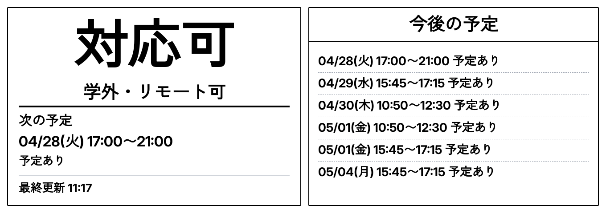
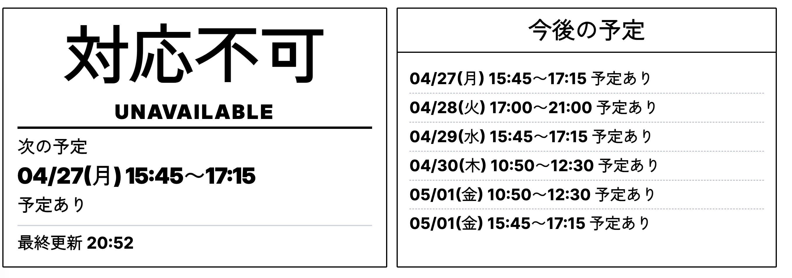
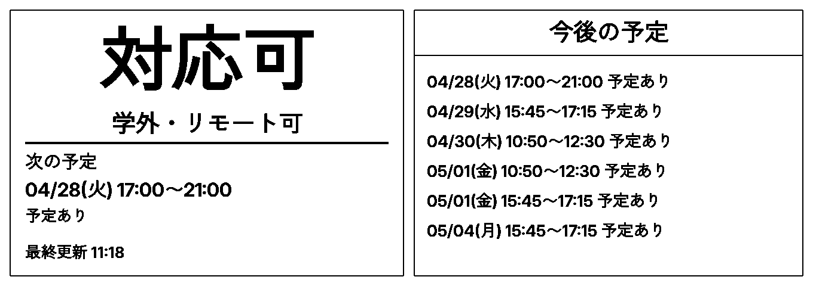

# epsign

Raspberry Pi 4 と Waveshare 10.85 inch e-Paper HAT+ を使った電子ペーパードアサインです。

`packages/doorsign` で在室表示ページと画像を生成し、`packages/drawer` でその画像を取得して電子ペーパーへ描画します。




## 構成

- `packages/doorsign`
  - Remix 製の表示サーバー
  - `/dashboard`, `/image.png`, `/dithered-image.png` を提供
- `packages/drawer`
  - Raspberry Pi 上で画像を取得し、電子ペーパーへ描画する Python スクリプト
- `scripts/button_controller.py`
  - `$HOME/override.json` と `$HOME/location_state.json` を更新する 2 ボタン監視スクリプト
- `scripts/update_epd.py`
  - `$HOME/update_epd.py` として配置し、`uv run draw-dashboard.py` を呼ぶ更新ラッパー
  - 既定で 100 秒タイムアウト。`UPDATE_EPD_TIMEOUT_SECONDS` で変更可能。`0` 以下で無制限
- `systemd/epsign-button.service`
  - ボタン監視スクリプトを常駐させるための systemd テンプレート

## 処理の流れ

1. Google Calendar から予定の busy 情報を取得する
2. 在室状態と統合してドアサイン画面を生成する
3. Playwright で `/dashboard` をスクリーンショットする
4. 7 色パレットへディザリングする
5. Raspberry Pi で画像を取得して電子ペーパーへ描画する



## 環境変数の初期設定

### doorsign

`packages/doorsign/.env` を作成して以下を設定します。

```properties
GOOGLE_CALENDAR_ID="your_calendar_id@example.com"
GOOGLE_API_KEY="your_google_api_key"
SERVER_PORT=3000
```

作成例:

```sh
cp packages/doorsign/.env.example packages/doorsign/.env
```

その後、`packages/doorsign/.env` を編集して値を埋めます。

### drawer

`packages/drawer/.env` を作成して以下を設定します。

```properties
DASHBOARD_URL="http://127.0.0.1:3000/dithered-image.png"
```

同じ Raspberry Pi 上で `doorsign` を動かすなら、この URL のままで構いません。

## サーバー

現在の構成では、Raspberry Pi 4 上に server と drawer を同居させる前提です。

## Docker Compose

`epsign/compose.yaml` で `doorsign` を起動できます。

```sh
docker compose up -d --build
```
